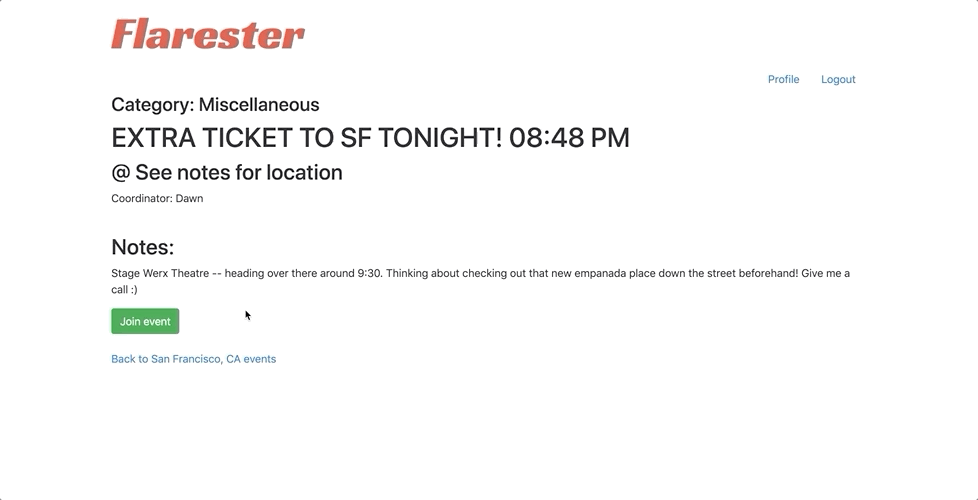
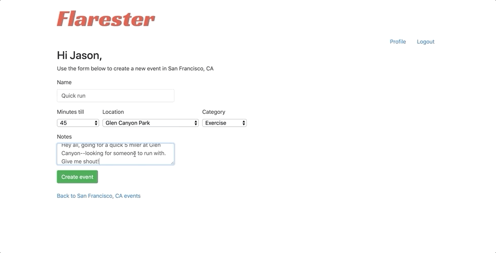
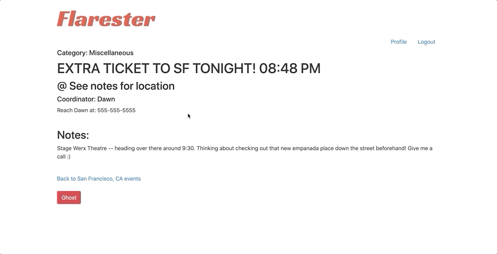

Introducing Flarester – the ultimate dynamic platform for creating and joining exciting events in your local area! Imagine a platform similar to "Meetup," but with an electrifying twist: it's all about events happening within the next two hours. That means you can instantly connect with the most engaging and relevant events around you!

Once an event is created, it's immediately added to the local event list, making it visible to all nearby users. This means endless possibilities for discovering new experiences and connecting with your local community. And the best part? After the event's scheduled time has passed, it magically disappears from the list, keeping the platform fresh and filled with only the most exciting events.

Flarester's mission is to spark casual networking, ignite new friendships, and expand your horizons. It's the perfect stage for interacting with your local community and forming connections with like-minded individuals who share your passions. Get ready to dive into a world of endless opportunities and meaningful connections with Flarester!

                                                 Create an account
                                                  

-----------------------------------------------------------------------------------------------------------------------------------

                                      Log in to view current events in your area
                                                       

-----------------------------------------------------------------------------------------------------------------------------------

                                                   Join an event
                                                   
  

-----------------------------------------------------------------------------------------------------------------------------------

                                              Create and list an event
                                              

-----------------------------------------------------------------------------------------------------------------------------------

-----------------------------------------------------------------------------------------------------------------------------------

                                                Back out of an event
                                                

-----------------------------------------------------------------------------------------------------------------------------------

                                             View and edit your profile
                                             

-----------------------------------------------------------------------------------------------------------------------------------

### Installation
The application is built using Ruby version 2.6.1. Once you have cloned the repository, please navigate to the application's directory and run the following commands:

- `bundle install`: This command installs the required gems and dependencies for the application to function correctly.
- `rails db:create`: This command creates the application's database.
- `rails db:migrate`: This command runs any pending migrations on the database.
- `rails db:seed`: This command seeds the database with the initial data.
  - If you have added new city and location objects in `app/db/seed.rb`, you must run `rails db:seed` again to ensure the database is seeded with the new data.

To run the application, type `rails s` into your command line (from the application's directory) and hit return. This command starts the application server, and you should be able to use the application.

Note that the application has a test suite you can run using RSpec. To install RSpec, type `rails g rspec:install` into your command line after cloning the repository. Once installed, type `rspec` into the command line and hit return to run the test suite.

## License
This project is licensed under the MIT License, making it free to use and modify. See the [LICENSE](https://github.com/seddonnguyen/Flarester/blob/main/LICENSE) file for details.

## Contact
Your engagement is important to me. Please feel free to reach out with any questions or feedback by opening an issue on the repository. Your input is highly valued.
